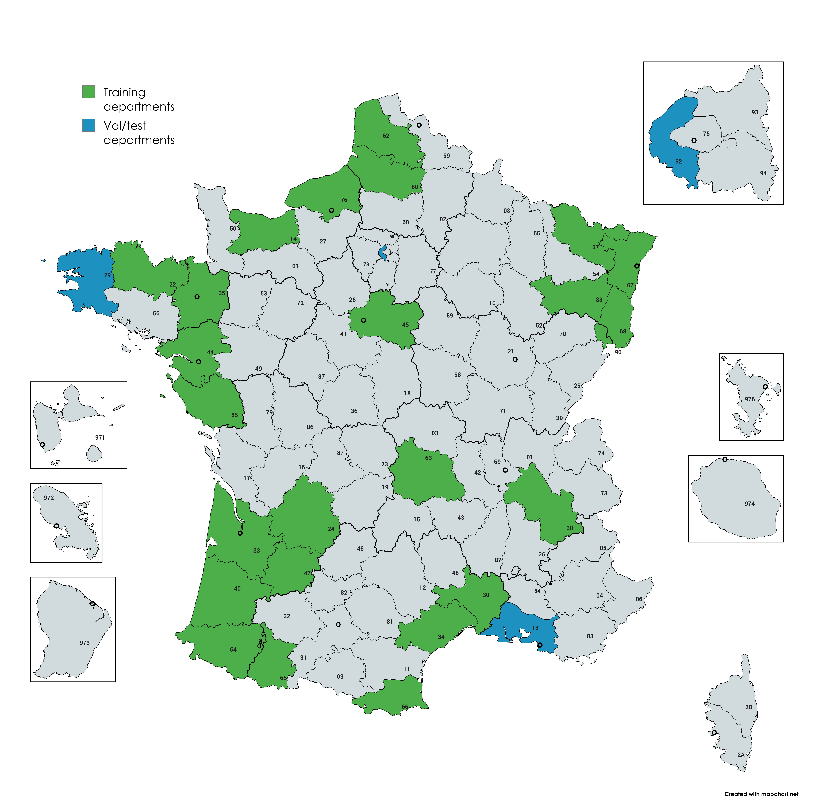

[](https://huggingface.co/datasets/retgenai/FOTBCD-Binary) [](https://arxiv.org/abs/2601.22596) [](LICENSE) [](https://creativecommons.org/licenses/by-nc-sa/4.0/)

# FOTBCD: Un Conjunto de Datos Geográficamente Diverso para la Detección de Cambios en Edificaciones a Partir de Imágenes Aéreas de Alta Resolución

Un punto de referencia a gran escala para la detección de cambios en edificaciones a partir de ortofotos y datos topográficos de Francia.

<p align="center">
  
</p>

## Conjuntos de datos

Publicamos dos versiones comunitarias derivadas de FOTBCD, ambas disponibles libremente bajo la licencia CC BY-NC-SA 4.0:

| Conjunto de datos | Departamentos | Pares | Tamaño de parche | Resolución | Anotación | Licencia |
|---------|-------------|-------|------------|------------|------------|---------|
| **FOTBCD-Binary** | 28 (25 entrenamiento / 3 evaluación) | ~28k | 512x512 | 0.2m | Máscara binaria | CC BY-NC-SA 4.0 |
| **FOTBCD-Instances** | 6 (3 entrenamiento / 3 evaluación) | 4k | 512x512 | 0.2m | Polígonos COCO | CC BY-NC-SA 4.0 |

---

<p align="center">
  <br>
  <em>Cobertura geográfica: 25 departamentos de entrenamiento (verde), 3 departamentos de evaluación reservados (azul)</em>
</p>

### Descarga

[Descarga (Google Drive)](https://drive.google.com/drive/folders/1XpV4ouhvVg0M28S7-u7PbDhYA56pQHRm?usp=sharing) - contiene FOTBCD-Binary, FOTBCD-Instances y pesos preentrenados.

### Estructura

```
FOTBCD-Binary/
    images/
        train/
            before/     # {id}.png
            after/      # {id}.png
            label/      # máscara binaria (0=sin cambio, 255=cambio)
        val/
        test/

FOTBCD-Instances/
    images/
        train/
            before/
            after/
        val/
        test/
    annotations/
        train.json      # formato COCO (categorías: UNCHANGED=1, DEMOLISHED=2, NEW=3)
        val.json
        test.json
```

## Instalación

```bash
conda env create -f environment.yml
conda activate fotbcd
```

Instale PyTorch por separado según su sistema: https://pytorch.org/get-started/locally/

Establezca las rutas de los conjuntos de datos en `config.py` antes del entrenamiento.

## Entrenamiento

```bash
python train.py
```
### Evaluación entre conjuntos de datos

```bash
python evaluate.py --checkpoints_dir ./checkpoints --batch_size 32
```

## Resultados

Generalización entre dominios (IoU):

| ↓ Entrenamiento / Evaluación → | FOTBCD-Binary | LEVIR-CD+ | WHU-CD |
|--------------|--------|-----------|--------|
| FOTBCD-Binary| 0.818  | 0.299     | 0.697  |
| LEVIR-CD+    | 0.300  | 0.737     | 0.544  |
| WHU-CD       | 0.342  | 0.213     | 0.894  |

Generalización entre dominios (F1):

| ↓ Entrenamiento / Evaluación → | FOTBCD-Binary | LEVIR-CD+ | WHU-CD |
|--------------|--------|-----------|--------|
| FOTBCD-Binary| 0.900  | 0.460     | 0.822  |
| LEVIR-CD+    | 0.462  | 0.848     | 0.704  |
| WHU-CD       | 0.509  | 0.351     | 0.944  |

Generalización entre dominios (Precisión):

| ↓ Entrenamiento / Evaluación → | FOTBCD-Binary | LEVIR-CD+ | WHU-CD |
|--------------|--------|-----------|--------|
| FOTBCD-Binary| 0.915  | 0.819     | 0.803  |
| LEVIR-CD+    | 0.802  | 0.880     | 0.829  |
| WHU-CD       | 0.736  | 0.821     | 0.956  |

Generalización entre dominios (Recall):

| ↓ Entrenamiento / Evaluación → | FOTBCD-Binary | LEVIR-CD+ | WHU-CD |
|--------------|--------|-----------|--------|
| FOTBCD-Binary| 0.886  | 0.320     | 0.841  |
| LEVIR-CD+    | 0.324  | 0.819     | 0.612  |
| WHU-CD       | 0.390  | 0.223     | 0.933  |

## Licencia

- **Código**: MIT
- **FOTBCD-Binary / FOTBCD-Instances**: [CC BY-NC-SA 4.0](https://creativecommons.org/licenses/by-nc-sa/4.0/)
- **Datos de origen**: BD ORTHO / BD TOPO del IGN bajo [Licence Ouverte 2.0](https://alliance.numerique.gouv.fr/licence-ouverte-open-licence/)

### FOTBCD (Licencia comercial)

Para aplicaciones industriales que requieran mayor escala y anotaciones completas a nivel de instancia:

| | |
|---|---|
| **Más de 220.000 pares de imágenes** | Cobertura multi-región en toda Francia |
| **Más de 950k polígonos de edificaciones** | NEW / DEMOLISHED / UNCHANGED por instancia |
| **Licencia comercial** | Para despliegue en producción y aplicaciones propietarias |

Contacte a **info@retgen.ai** para consultas sobre licencias. Las colaboraciones académicas son bienvenidas.
## Citación

Si utiliza FOTBCD en su investigación, por favor cite nuestro artículo:

```bibtex
@misc{moubane2026fotbcd,
      title={FOTBCD: A Large-Scale Building Change Detection Benchmark from French Orthophotos and Topographic Data},
      author={Abdelrrahman Moubane},
      year={2026},
      eprint={2601.22596},
      archivePrefix={arXiv},
      primaryClass={cs.CV},
      url={https://arxiv.org/abs/2601.22596},
}
```

## Agradecimientos

FOTBCD se deriva de las bases de datos BD ORTHO y BD TOPO del [Institut national de l'information géographique et forestière (IGN)](https://www.ign.fr/).
