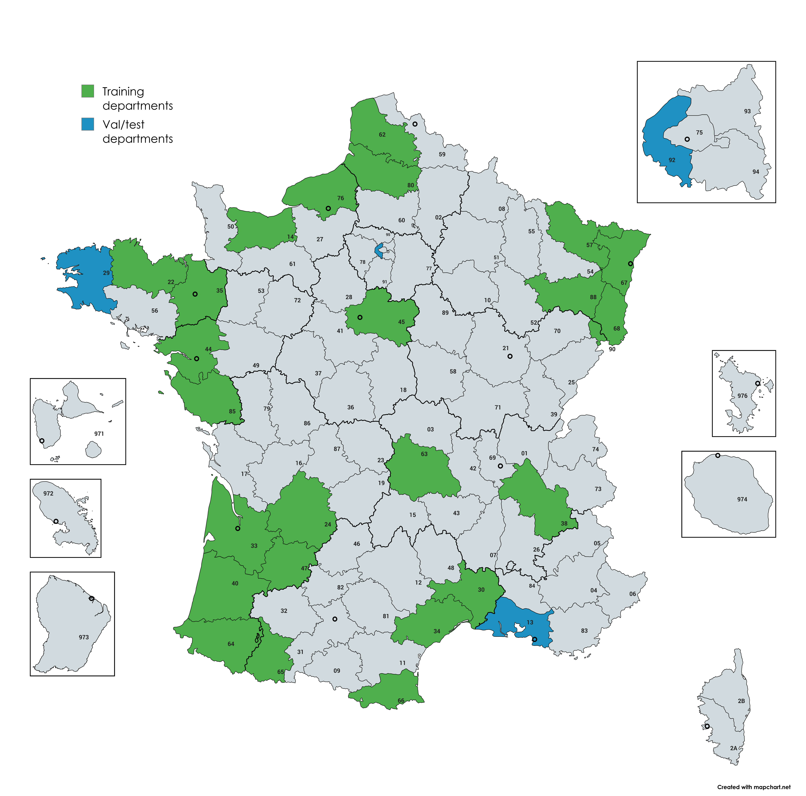

[](https://huggingface.co/datasets/retgenai/FOTBCD-Binary) [](https://arxiv.org/abs/2601.22596) [](LICENSE) [](https://creativecommons.org/licenses/by-nc-sa/4.0/)

# FOTBCD: A Geographically Diverse Dataset for Building Change Detection from High-Resolution Aerial Imagery

A large-scale building change detection benchmark from French orthophotos and topographic data.

<p align="center">
  
</p>

## Datasets

| Dataset | Departments | Pairs | Patch Size | Resolution | Annotation | License |
|---------|-------------|-------|------------|------------|------------|---------|
| **FOTBCD-Binary** | 28 (25 train / 3 eval) | ~28k | 512x512 | 0.2m | Binary mask | CC BY-NC-SA 4.0 |
| **FOTBCD-Instances** | 6 (3 train / 3 eval) | 4k | 512x512 | 0.2m | COCO polygons | CC BY-NC-SA 4.0 |

---

<p align="center">
  <br>
  <em>Geographic coverage: 25 training departments (green), 3 held-out evaluation departments (blue)</em>
</p>

### Download

[Download (Google Drive)](https://drive.google.com/drive/folders/1XpV4ouhvVg0M28S7-u7PbDhYA56pQHRm?usp=sharing) - contains FOTBCD-Binary, FOTBCD-Instances, and pretrained weights.

### Structure

```
FOTBCD-Binary/
    images/
        train/
            before/     # {id}.png
            after/      # {id}.png
            label/      # binary mask (0=no change, 255=change)
        val/
        test/

FOTBCD-Instances/
    images/
        train/
            before/
            after/
    annotations/
        train.json      # COCO format (categories: UNCHANGED=1, DEMOLISHED=2, NEW=3)
        val.json
        test.json
```

## Installation

```bash
conda env create -f environment.yml
conda activate fotbcd
```

Install PyTorch separately based on your system: https://pytorch.org/get-started/locally/

Set the dataset paths in `config.py` before training.

## Training

```bash
python train.py
```
### Cross-Dataset Evaluation

```bash
python evaluate.py --checkpoints_dir ./checkpoints --batch_size 32
```

## Results

Cross-domain generalization (IoU):

| Train / Test | FOTBCD-Binary | LEVIR-CD+ | WHU-CD |
|--------------|--------|-----------|--------|
| FOTBCD-Binary| 0.818  | 0.299     | 0.697  |
| LEVIR-CD+    | 0.300  | 0.737     | 0.544  |
| WHU-CD       | 0.342  | 0.213     | 0.894  |

Cross-domain generalization (F1):

| Train / Test | FOTBCD-Binary | LEVIR-CD+ | WHU-CD |
|--------------|--------|-----------|--------|
| FOTBCD-Binary| 0.900  | 0.460     | 0.822  |
| LEVIR-CD+    | 0.462  | 0.848     | 0.704  |
| WHU-CD       | 0.509  | 0.351     | 0.944  |

Cross-domain generalization (Precision):

| Train / Test | FOTBCD-Binary | LEVIR-CD+ | WHU-CD |
|--------------|--------|-----------|--------|
| FOTBCD-Binary| 0.915  | 0.819     | 0.803  |
| LEVIR-CD+    | 0.802  | 0.880     | 0.829  |
| WHU-CD       | 0.736  | 0.821     | 0.956  |

Cross-domain generalization (Recall):

| Train / Test | FOTBCD-Binary | LEVIR-CD+ | WHU-CD |
|--------------|--------|-----------|--------|
| FOTBCD-Binary| 0.886  | 0.320     | 0.841  |
| LEVIR-CD+    | 0.324  | 0.819     | 0.612  |
| WHU-CD       | 0.390  | 0.223     | 0.933  |

## License

- **Code**: MIT
- **FOTBCD-Binary / FOTBCD-Instances**: [CC BY-NC-SA 4.0](https://creativecommons.org/licenses/by-nc-sa/4.0/)
- **Source Data**: BD ORTHO / BD TOPO by IGN under [Licence Ouverte 2.0](https://alliance.numerique.gouv.fr/licence-ouverte-open-licence/)

### FOTBCD-220k (Commercial License)

For industrial applications requiring larger scale and full instance-level annotations:

| | |
|---|---|
| **220,000+ image pairs** | Multi-region coverage across France |
| **1.5M+ building polygons** | NEW / DEMOLISHED / UNCHANGED per instance |
| **Commercial license** | For production deployment and proprietary applications |

Contact **info@retgen.ai** for licensing inquiries. Academic collaborations are welcome.
## Citation

If you use FOTBCD in your research, please cite our paper:

```bibtex
@misc{moubane2026fotbcd,
      title={FOTBCD: A Large-Scale Building Change Detection Benchmark from French Orthophotos and Topographic Data},
      author={Abdelrrahman Moubane},
      year={2026},
      eprint={2601.22596},
      archivePrefix={arXiv},
      primaryClass={cs.CV},
      url={https://arxiv.org/abs/2601.22596},
}
```

## Acknowledgments

FOTBCD is derived from BD ORTHO and BD TOPO databases by [Institut national de l'information géographique et forestière (IGN)](https://www.ign.fr/).
